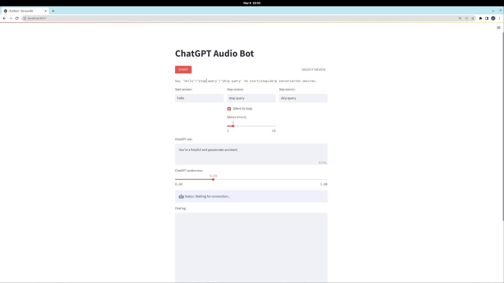

# ChatGPT Audio Bot

This repo is a POC of an audio chatbot using [ChatGPT].

## Prerequisites
- Nvidia docker - Follow this [tutorial](https://docs.nvidia.com/datacenter/cloud-native/container-toolkit/install-guide.html#docker) to install
- Nvidia GPU (>= 10GB VRAM is recommended)
    - Tested on RTX 2080 Ti and RTX 3090

## Getting Started

Clone this repo
```
git clone --recursive https://github.com/LanyTek/ChatGPT_Audio_Bot.git
```

Build docker image or using our pre-built image
```
docker build -f Dockerfile -t lanytek/chatgpt_audiobot:v0.0.1 .

OR

docker pull lanytek/chatgpt_audiobot:v0.0.1
```

```
docker run -it --gpus=all --privileged -p 8501:8501 -e OPENAI_API_KEY="PUT_YOUR_OPENAPI_KEY_HERE" lanytek/chatgpt_audiobot:v0.0.1
```

Wait until streamlit server is ready, then open http://localhost:8501 in your browser.

### Environment Variables
- `OPENAI_API_KEY` - OpenAI API key
- `CHATGPT_CONTEXT_LENGTH` - Number of historical messages to use as context for the next message. Default is 5.
- `CHATGPT_MAX_LENGTH` - Maximum length of the request. Default is 500.
- `API_KEY` - API key for streamlit server. Used to enforce basic authentication to the service. Default is ``.

## Video Demo
<p style="text-align:center;">
<a href="https://www.youtube.com/watch?v=e9n0BJfMyKw">

</a>
</p>